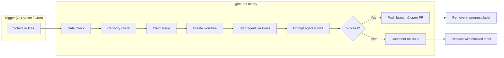
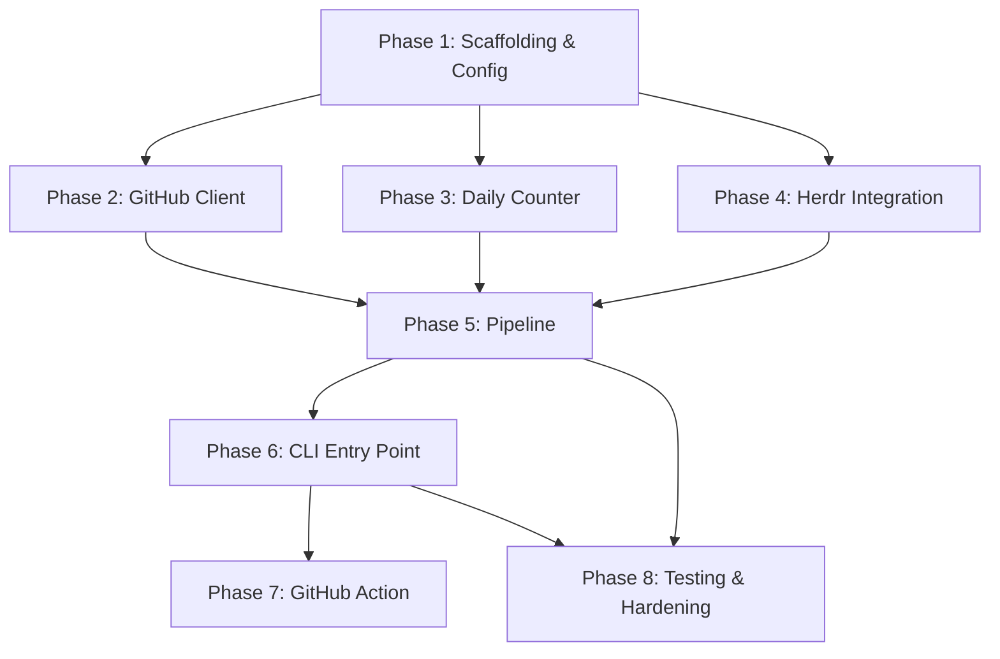

# Lights-Out — Implementation Plan (v1)

> Personal Agentic Software Factory: tagged GitHub issue → PR, zero human prompting.

## Architecture Overview



## Project Structure

```
lights-out/
├── cmd/
│   └── lights-out/
│       └── main.go                 # CLI entry point
├── internal/
│   ├── config/
│   │   ├── config.go               # YAML parsing + validation
│   │   └── config_test.go
│   ├── github/
│   │   ├── client.go               # GitHub API: issues, labels, PRs, comments
│   │   ├── client_test.go
│   │   └── types.go                # Domain types (Issue, PR, etc.)
│   ├── herdr/
│   │   ├── client.go               # Herdr CLI wrapper (worktree, agent, pane)
│   │   └── client_test.go
│   ├── pipeline/
│   │   ├── pipeline.go             # Orchestration: gate → claim → execute → output
│   │   └── pipeline_test.go
│   └── daily/
│       ├── counter.go              # Daily claim counter (UTC boundary, file-backed)
│       └── counter_test.go
├── config.yaml                     # Default/example config
├── go.mod
├── go.sum
├── .github/
│   └── workflows/
│       └── factory.yml             # GitHub Action trigger
├── .goreleaser.yaml                # Optional: binary releases
└── README.md
```

## Tech Stack

| Concern | Choice | Rationale |
|---|---|---|
| Language | Go 1.22+ | Single binary, no runtime deps |
| GitHub API | `google/go-github` + `oauth2` | Mature, typed, official |
| Config | `gopkg.in/yaml.v3` | Direct YAML mapping to struct |
| Herdr integration | `os/exec` wrapper | Herdr exposes CLI commands over a socket API; no client lib needed |
| Testing | `testing` + `testify` | Standard + readable assertions |
| CI trigger | GitHub Actions (cron) | Native, `concurrency` group solves overlapping runs (§9) |

---

## Phases

### Phase 1 — Scaffolding & Config

**Goal:** Runnable binary that loads and validates config.

**Tasks:**
1. `go mod init github.com/Zheng5005/lights-out`
2. Define `internal/config/config.go`:
   ```go
   type Config struct {
       Enabled          bool   `yaml:"enabled"`
       Repo             string `yaml:"repo"`            // "owner/repo"
       ConcurrencyLimit int    `yaml:"concurrency_limit"`
       DailyLimit       int    `yaml:"daily_limit"`
       Labels           Labels `yaml:"labels"`
       Agent            Agent  `yaml:"agent"`
   }
   type Labels struct {
       Trigger    string `yaml:"trigger"`      // "dark-factory"
       InProgress string `yaml:"in_progress"`  // "factory-in-progress"
       Blocked    string `yaml:"blocked"`      // "factory-blocked"
   }
   type Agent struct {
       Dispatcher string `yaml:"dispatcher"`   // "herdr"
       Mode       string `yaml:"mode"`         // "headless"
       Kind       string `yaml:"kind"`         // e.g. "agy", "claude", "gemini"
   }
   ```
3. Config loading: file path from `LIGHTS_OUT_CONFIG` env var, fallback to `./config.yaml`.
4. Validation: `Repo` must be `owner/repo`, limits > 0, label names non-empty.
5. `cmd/lights-out/main.go`: load config, print it, exit. Proof of life.

**Exit criteria:** `./lights-out` prints parsed config and exits 0.

---

### Phase 2 — GitHub Client

**Goal:** Read issues, manage labels, create PRs, post comments.

**Tasks:**
1. Define interface (for testability):
   ```go
   type GitHubClient interface {
       // Query
       ListIssuesByLabel(ctx, label string) ([]Issue, error)
       CountIssuesByLabel(ctx, label string) (int, error)

       // Labels
       AddLabel(ctx, issueNum int, label string) error
       RemoveLabel(ctx, issueNum int, label string) error

       // Output
       CreatePR(ctx, head, base, title, body string) (*PullRequest, error)
       CommentOnIssue(ctx, issueNum int, body string) error
   }
   ```
2. Implement with `google/go-github`. Auth via `GITHUB_TOKEN` env var.
3. `ListIssuesByLabel` must filter OUT issues that also have `in_progress` or `blocked` labels (claim candidates only).
4. `CreatePR` body must include `Closes #<issueNum>` keyword.
5. Unit tests with a mock implementation of the interface.

**Exit criteria:** Integration smoke test that lists issues on a test repo.

---

### Phase 3 — Daily Counter

**Goal:** Track how many issues have been claimed today (UTC boundary).

**Tasks:**
1. Simple file-backed counter at `~/.lights-out/daily-claims.json`:
   ```json
   {"date": "2026-10-02", "count": 1}
   ```
2. `Increment() (int, error)` — bumps count, resets if date changed.
3. `Current() (int, error)` — reads without mutating.
4. File path configurable via env var for testing.

> [!NOTE]
> The PRD says count at claim time (§9). The counter increments when an issue is claimed, not when the PR is opened.

**Exit criteria:** Unit tests covering day rollover and concurrent-safe file access.

---

### Phase 4 — Herdr Integration

**Goal:** Wrap Herdr CLI to create worktrees, start agents, prompt, wait, and read output.

**Tasks:**
1. Define interface:
   ```go
   type HerdrClient interface {
       CreateWorktree(ctx, cwd, branch, base string) (worktreeID string, err error)
       CreateWorkspace(ctx, path string) (workspaceID string, err error)
       SplitPane(ctx, workspaceID string) (paneID string, err error)
       StartAgent(ctx, name, kind, paneID string) error
       PromptAgent(ctx, target, text string, timeoutMs int) (status string, err error)
       WaitAgent(ctx, target string, until []string, timeoutMs int) (status string, err error)
       ReadAgent(ctx, target string) (string, error)
       CloseWorkspace(ctx, workspaceID string) error
       RemoveWorktree(ctx, worktreeID string) error
   }
   ```
2. Each method wraps `herdr <subcommand>` via `os/exec.CommandContext`.
3. Parse JSON output where available, fallback to exit code + stderr.
4. Key flow:
   - `herdr worktree create --cwd <repo> --branch factory/issue-<N> --base main`
   - `herdr pane split` (get a pane in the worktree workspace)
   - `herdr agent start <name> --kind <kind> --pane <paneID>`
   - `herdr agent prompt <target> "<task>" --wait --timeout <ms>`
   - Check final status: `idle`/`done` = success, `blocked` = failure
   - `herdr agent read <target>` for output/diagnostics

> [!IMPORTANT]
> The Herdr server must be running before the factory executes. The GitHub Action must either ensure it's started or the factory should verify connectivity and fail fast with a clear error.

**Exit criteria:** Can programmatically create a worktree, start an agent, prompt it, and read its final state.

---

### Phase 5 — Pipeline Orchestration

**Goal:** The full end-to-end loop from §4 of the PRD.

**Tasks:**
1. `pipeline.Run(ctx, cfg, gh, herdr, daily)` — the main orchestration function.
2. Step-by-step implementation:

   | Step | Action | Failure mode |
   |------|--------|-------------|
   | Gate | `if !cfg.Enabled { return }` | Silent exit (by design) |
   | Capacity: concurrency | `gh.CountIssuesByLabel(cfg.Labels.InProgress) >= cfg.ConcurrencyLimit` | Silent exit |
   | Capacity: daily | `daily.Current() >= cfg.DailyLimit` | Silent exit |
   | Claim | Find oldest `dark-factory` issue without `in-progress`/`blocked` | No candidates → silent exit |
   | Lock | `gh.AddLabel(issue, cfg.Labels.InProgress)` then `daily.Increment()` | If label fails → abort, no work |
   | Execute | Herdr worktree → agent → prompt → wait | On any error → comment + blocked label |
   | Success | `git push`, `gh.CreatePR(...)`, `gh.RemoveLabel(issue, InProgress)` | If PR creation fails → comment + blocked |
   | Error | `gh.CommentOnIssue(issue, errorMsg)`, swap to blocked label | Must succeed or log critically |

3. **Defer-based cleanup:** The `InProgress` label removal and worktree cleanup must happen on ALL exit paths, including panics. Use `defer` with a cleanup function.
4. **Single comment guarantee (FR6):** Track whether a comment has been posted; never post two.
5. The `git push` before PR creation uses `os/exec` with the worktree path. Branch name: `factory/issue-<N>`.

**Exit criteria:** Full loop works against a real repo with a test issue. Success path produces a PR. Error path produces a comment + blocked label.

---

### Phase 6 — CLI Entry Point

**Goal:** Clean CLI with proper exit codes and logging.

**Tasks:**
1. `cmd/lights-out/main.go`:
   - Load config
   - Initialize GitHub client, Herdr client, daily counter
   - Call `pipeline.Run()`
   - Exit 0 on success/no-op, exit 1 on unrecoverable error
2. Structured logging with `log/slog` (stdlib, no deps).
3. Log every step transition: `gate=passed`, `capacity=ok (1/2)`, `claiming=#42`, etc.
4. `--dry-run` flag: runs gate + capacity + claim selection, logs what WOULD happen, but doesn't label or execute.

**Exit criteria:** `./lights-out` runs the full pipeline. `./lights-out --dry-run` shows what it would do.

---

### Phase 7 — GitHub Action

**Goal:** Scheduled trigger with non-concurrent execution.

**Tasks:**
1. `.github/workflows/factory.yml`:
   ```yaml
   name: Dark Factory
   on:
     schedule:
       - cron: '*/15 * * * *'    # Every 15 min — tune later
     workflow_dispatch: {}        # Manual trigger for testing

   concurrency:
     group: dark-factory
     cancel-in-progress: false    # Don't cancel running work

   jobs:
     run:
       runs-on: self-hosted       # Needs Herdr server access
       steps:
         - uses: actions/checkout@v4
         - name: Run factory
           env:
             GITHUB_TOKEN: ${{ secrets.GITHUB_TOKEN }}
             LIGHTS_OUT_CONFIG: ./config.yaml
           run: ./lights-out
   ```
2. The `concurrency` group with `cancel-in-progress: false` solves the overlapping trigger race (§9).
3. Binary must be pre-built and available on the runner, OR the action builds it first.

> [!WARNING]
> This needs a **self-hosted runner** because the factory must talk to a local Herdr server. A standard GitHub-hosted runner won't have Herdr. This is a deployment constraint, not a code issue.

**Exit criteria:** Manual `workflow_dispatch` triggers the factory end to end.

---

### Phase 8 — Testing & Hardening

**Goal:** Confidence that the loop is trustworthy (v1's core value).

**Tasks:**
1. **Unit tests** for every package with mocked interfaces (~80% coverage target).
2. **Integration test script** that:
   - Creates a test issue with `dark-factory` label
   - Runs the binary
   - Asserts: `factory-in-progress` was applied, PR was opened, label was removed
3. **Edge case tests:**
   - Gate disabled → no side effects
   - Concurrency at limit → no claim
   - Daily limit hit → no claim
   - Agent returns `blocked` → comment + label
   - Herdr server not running → fast fail with clear error
   - PR creation fails after agent succeeds → comment + blocked (no orphaned work)
4. **Linting:** `golangci-lint` with sensible defaults.

**Exit criteria:** `go test ./...` passes. Integration test passes against a test repo.

---

## Dependency Graph



> Phases 2, 3, and 4 are independent of each other and can be built in parallel after Phase 1.

---

## Open Design Decisions

| # | Question | My Recommendation | Impact |
|---|----------|-------------------|--------|
| 1 | **Which agent kind for Herdr?** (`--kind agy`, `claude`, `gemini`, etc.) | Make it a config field (`agent.kind`) | Phase 1 config struct |
| 2 | **Where does the factory binary run?** Self-hosted runner vs. your dev machine vs. a VPS? | Self-hosted runner that has Herdr | Phase 7 action definition |
| 3 | **Herdr server lifecycle** — does the factory start/stop it, or assume it's always running? | Assume running, fail fast if not | Phase 4 client |
| 4 | **Worktree base ref** — always `main`, or configurable? | Config field, default `main` | Phase 1 config |
| 5 | **Agent timeout** — how long before the factory considers the agent hung? | Config field, default 30 min | Phase 4 |

---

## Estimated Effort

| Phase | Effort | Cumulative |
|-------|--------|------------|
| 1. Scaffolding & Config | ~1h | 1h |
| 2. GitHub Client | ~2h | 3h |
| 3. Daily Counter | ~1h | 4h |
| 4. Herdr Integration | ~3h | 7h |
| 5. Pipeline Orchestration | ~3h | 10h |
| 6. CLI Entry Point | ~1h | 11h |
| 7. GitHub Action | ~1h | 12h |
| 8. Testing & Hardening | ~3h | 15h |

~15 hours of focused work for a complete, testable v1.
